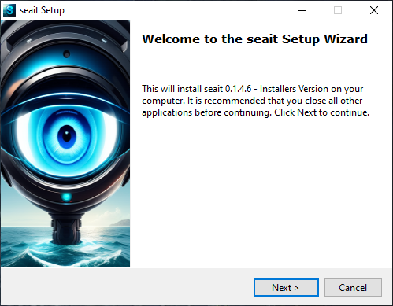
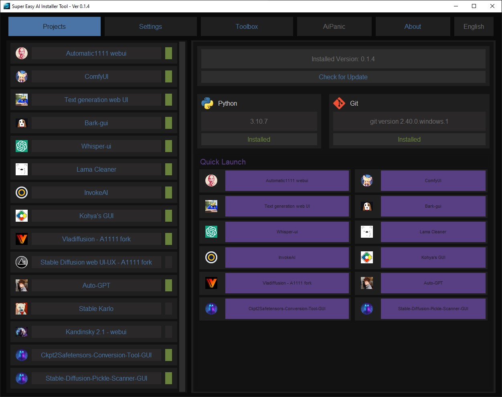
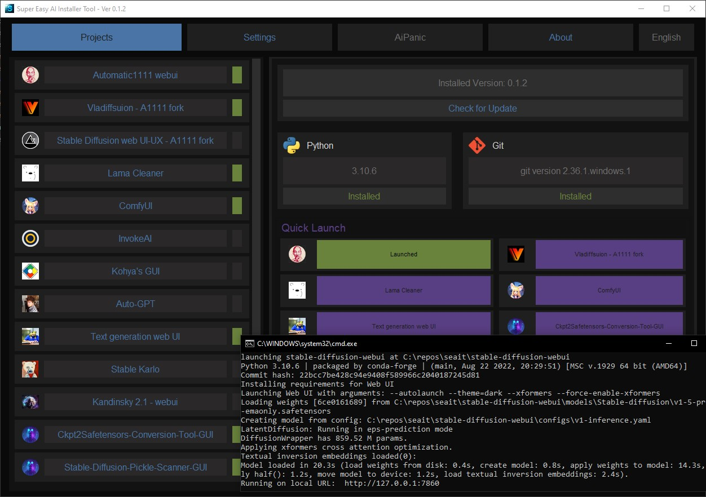
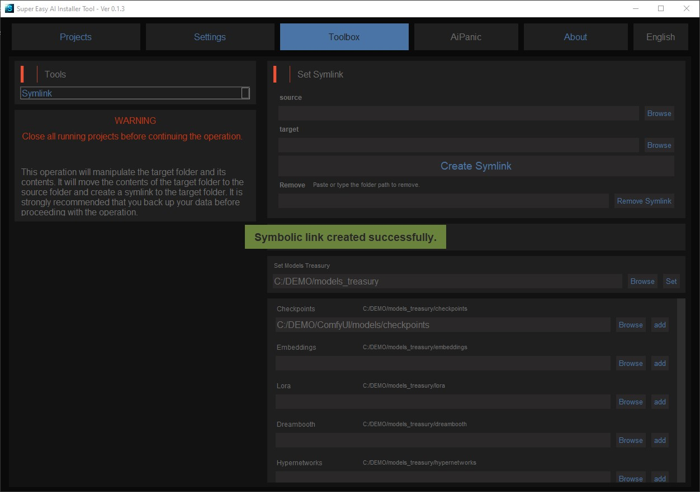
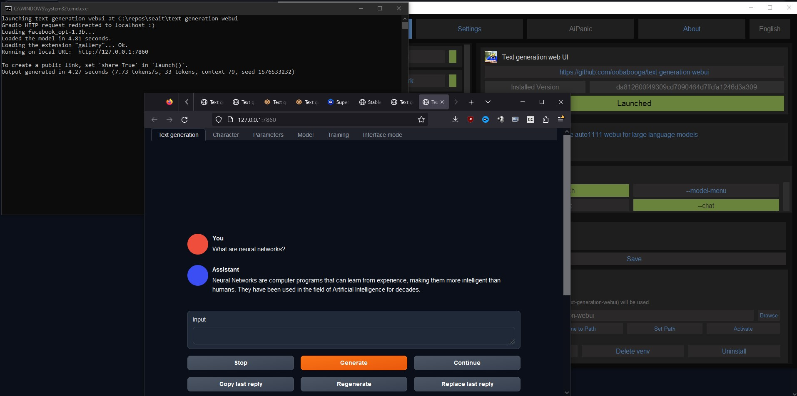
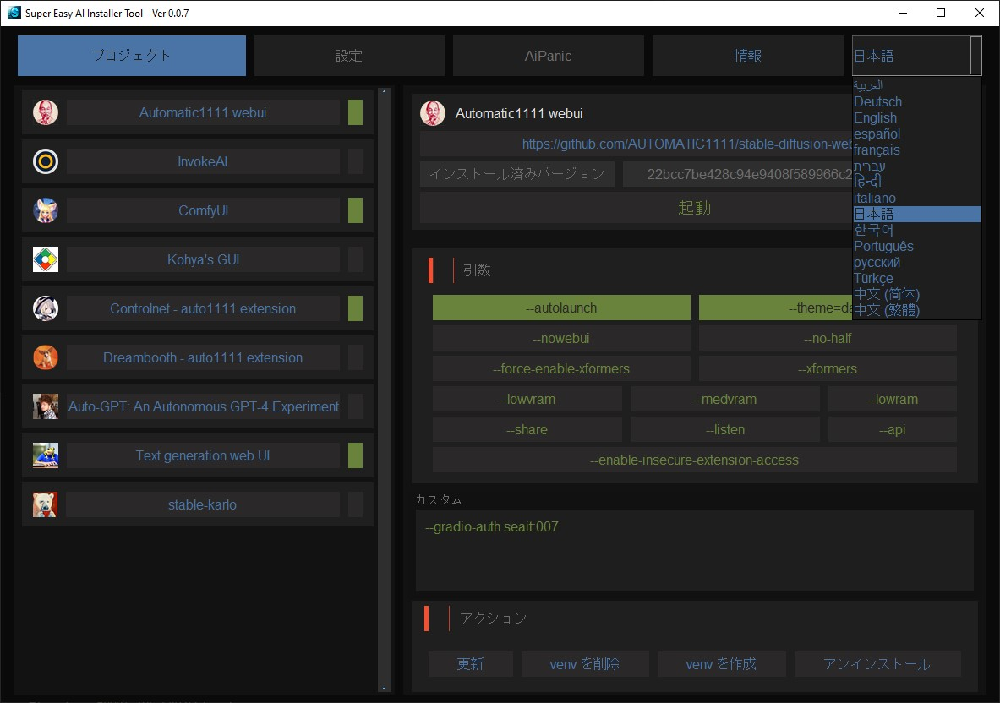
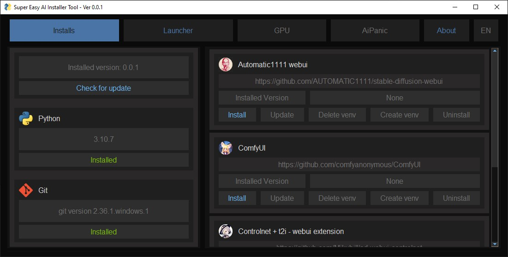

<!-- Improved compatibility of back to top link: See: https://github.com/othneildrew/Best-README-Template/pull/73 -->

<!--
*** Thanks for checking out the Best-README-Template. If you have a suggestion
*** that would make this better, please fork the repo and create a pull request
*** or simply open an issue with the tag "enhancement".
*** Don't forget to give the project a star!
*** Thanks again! Now go create something AMAZING! :D
-->
<!--
*** I'm using markdown "reference style" links for readability.
*** Reference links are enclosed in brackets [ ] instead of parentheses ( ).
*** See the bottom of this document for the declaration of the reference variables
*** for contributors-url, forks-url, etc. This is an optional, concise syntax you may use.
*** https://www.markdownguide.org/basic-syntax/#reference-style-links
-->
 

  <h1 align="center">Super Easy AI Installer Tool</h1>
  <h4 align="center"><em>One SEAIT to Install Them, One Click to Launch Them, One Space-Saving Models Folder to Bind Them All.</em></h4>
  <h4 align="center">Don't forget to leave a star.</h4>
  
  
  

    <a href="https://github.com/diStyApps/seait/issues">Report Bug</a>
    ·
    <a href="https://github.com/diStyApps/seait/discussions/11">Request Feature</a>
  

<!-- TABLE OF CONTENTS -->

  
Table of Contents

  <ol>
    <li>
      <a href="#about-the-project">About The Project</a>
    </li>
    <li><a href="#roadmap">Roadmap</a></li>
    <li><a href="#localization">Localization</a></li>
    <li><a href="#contact">Contact</a></li>
    <li><a href="#my-other-projects">My Other Projects</a></li>    
    <li><a href="#acknowledgments">Acknowledgments</a></li>
  </ol>

<!-- ABOUT THE PROJECT -->
## About The Project

"Super Easy AI Installer Tool" is a user-friendly application that simplifies the installation process of AI-related repositories for users.
The tool is designed to provide an easy-to-use solution for accessing and installing AI repositories with minimal technical hassle to none the tool will automatically handle the installation process, making it easier for users to access and use AI tools.

### Early development

"Super Easy AI Installer Tool" is currently in early development phase and may have a few bugs. 
But remains a great solution for users with minimal technical knowledge or expertise. Fixes underway.

### Tested on Windows 10+ and Nvidia GPU-based cards

### Update [0.1.4.8] 

Added:

  - LoRA_Easy_Training_Scripts

Fixed:

  - InvokeAI installation

### Spread the word; don't only keep it to yourself.

(<a href="#readme-top">back to top</a>)

## Downloads

### For Windows 10+ and Nvidia GPU-based cards
[Releases](https://github.com/diStyApps/seait/releases)

[CIVITAI](https://civitai.com/models/27574/super-easy-ai-installer-tool)

$${\color{red}Note}$$
### False Positive Virustotal

Please note that Virustotal and other antivirus programs may give a false positive when running this app. This is due to the app being compiled with Pyinstaller, which can sometimes trigger false positives. 

Unfortunately, I don't have the time to handle these false positives. However, please rest assured that the code is transparent and you are free to use it at your own discretion.

In the future ill try maybe nukita or something.

(<a href="#readme-top">back to top</a>)

<!-- ROADMAP -->
## Roadmap

- [x] Support for multiple languages
- [x] Adding more projects
- [x] Customizable project directory
- [x] User-defined arguments
- [x] Saving argument configurations
- [ ] In-app update feature
- [ ] Potential argument profile management
- [ ] Better event handling
- [ ] Pre-installed auto1111 version
- [ ] Fully independent version without Python or Git dependencies

See the [Project/Feature Requests](https://github.com/diStyApps/seait/discussions/11) for a full list of proposed features (and known issues).

(<a href="#readme-top">back to top</a>)

<!-- LOCALIZATION -->
## Localization

Spanish (es_ES), French (fr_FR), German (de_DE), Italian (it_IT), Portuguese (pt_BR), Russian (ru_RU), Chinese Simplified (zh_CN), Chinese Traditional (zh_TW), Japanese (ja_JP), Korean (ko_KR), Arabic (ar_AR), Hebrew (he_IL), Hindi (hi_IN)

All translations were done by AI. Please feel free to correct them.

(<a href="#readme-top">back to top</a>)

<!-- CONTACT -->
## Contact

distty@gmail.com

[Facebook](https://www.facebook.com/disty.fc)

(<a href="#readme-top">back to top</a>)

<!-- MY OTHER PROJECTS -->
## My Other Projects

[https://github.com/diStyApps/Stable-Diffusion-Pickle-Scanner-GUI](https://github.com/diStyApps/Stable-Diffusion-Pickle-Scanner-GUI)

[https://github.com/Safe-and-Stable-Ckpt2Safetensors-Conversion-Tool-GUI](https://github.com/diStyApps/Safe-and-Stable-Ckpt2Safetensors-Conversion-Tool-GUI)

(<a href="#readme-top">back to top</a>)

<!-- ACKNOWLEDGMENTS -->
## Acknowledgments

* [AUTOMATIC1111- stable-diffusion-webui](https://github.com/AUTOMATIC1111/stable-diffusion-webui)
* [InvokeAI](https://github.com/invoke-ai/InvokeAI)
* [ComfyUI](https://github.com/comfyanonymous/ComfyUI)
* [Kohya's GUI](https://github.com/bmaltais/kohya_ss)
* [sd-webui-controlnet](https://github.com/Mikubill/sd-webui-controlnet)
* [sd_dreambooth_extension](https://github.com/d8ahazard/sd_dreambooth_extension)

<!-- * [GitHub Emoji Cheat Sheet](https://www.webpagefx.com/tools/emoji-cheat-sheet)
* [Malven's Flexbox Cheatsheet](https://flexbox.malven.co/)
* [Malven's Grid Cheatsheet](https://grid.malven.co/)
* [Img Shields](https://shields.io)
* [GitHub Pages](https://pages.github.com)
* [Font Awesome](https://fontawesome.com)
* [React Icons](https://react-icons.github.io/react-icons/search)-->

(<a href="#readme-top">back to top</a>)

<!-- MARKDOWN LINKS & IMAGES -->
<!-- https://www.markdownguide.org/basic-syntax/#reference-style-links -->
[contributors-shield]: https://img.shields.io/github/contributors/othneildrew/Best-README-Template.svg?style=for-the-badge
[contributors-url]: https://github.com/othneildrew/Best-README-Template/graphs/contributors
[forks-shield]: https://img.shields.io/github/forks/othneildrew/Best-README-Template.svg?style=for-the-badge
[forks-url]: https://github.com/othneildrew/Best-README-Template/network/members
[stars-shield]: https://img.shields.io/github/stars/othneildrew/Best-README-Template.svg?style=for-the-badge
[stars-url]: https://github.com/othneildrew/Best-README-Template/stargazers
[issues-shield]: https://img.shields.io/github/issues/othneildrew/Best-README-Template.svg?style=for-the-badge
[issues-url]: https://github.com/othneildrew/Best-README-Template/issues
[license-shield]: https://img.shields.io/github/license/othneildrew/Best-README-Template.svg?style=for-the-badge
[license-url]: https://github.com/othneildrew/Best-README-Template/blob/master/LICENSE.txt
[linkedin-shield]: https://img.shields.io/badge/-LinkedIn-black.svg?style=for-the-badge&logo=linkedin&colorB=555
[linkedin-url]: https://linkedin.com/in/othneildrew
[product-screenshot]: images/screenshot.png
[Next.js]: https://img.shields.io/badge/next.js-000000?style=for-the-badge&logo=nextdotjs&logoColor=white
[Next-url]: https://nextjs.org/
[React.js]: https://img.shields.io/badge/React-20232A?style=for-the-badge&logo=react&logoColor=61DAFB
[React-url]: https://reactjs.org/
[Vue.js]: https://img.shields.io/badge/Vue.js-35495E?style=for-the-badge&logo=vuedotjs&logoColor=4FC08D
[Vue-url]: https://vuejs.org/
[Angular.io]: https://img.shields.io/badge/Angular-DD0031?style=for-the-badge&logo=angular&logoColor=white
[Angular-url]: https://angular.io/
[Svelte.dev]: https://img.shields.io/badge/Svelte-4A4A55?style=for-the-badge&logo=svelte&logoColor=FF3E00
[Svelte-url]: https://svelte.dev/
[Laravel.com]: https://img.shields.io/badge/Laravel-FF2D20?style=for-the-badge&logo=laravel&logoColor=white
[Laravel-url]: https://laravel.com
[Bootstrap.com]: https://img.shields.io/badge/Bootstrap-563D7C?style=for-the-badge&logo=bootstrap&logoColor=white
[Bootstrap-url]: https://getbootstrap.com
[JQuery.com]: https://img.shields.io/badge/jQuery-0769AD?style=for-the-badge&logo=jquery&logoColor=white
[JQuery-url]: https://jquery.com 

